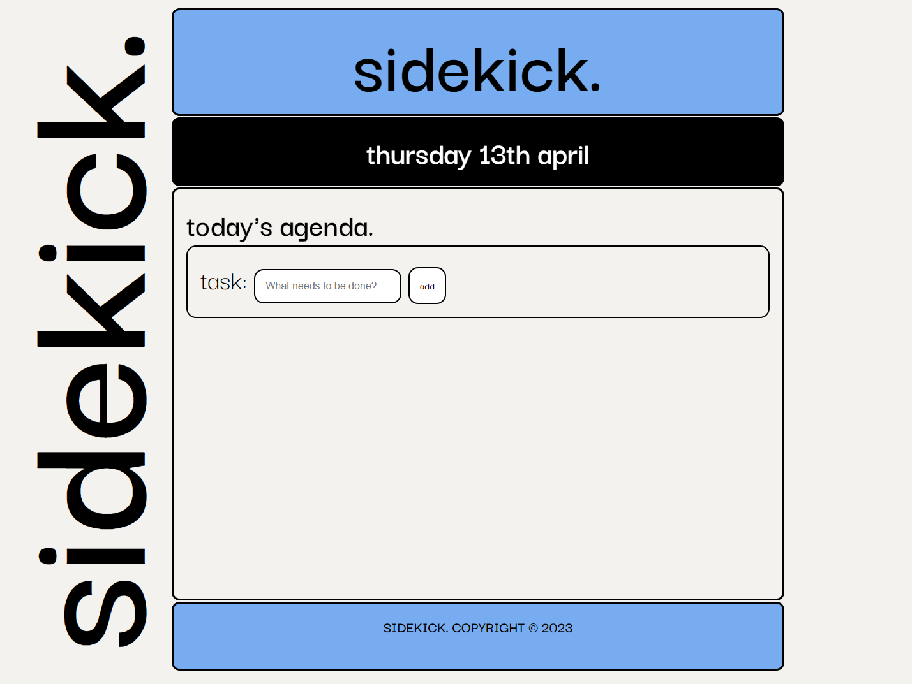

# Sidekick

## Overview

Sidekick is an app to keep track of daily to-dos. It incorporates Moment.js to dynamically generate the date.

## Technologies used

HTML, CSS, JavaScript, jQuery, and Moment.js

## Screenshot

  

## Link to Deployed Site

https://side-kick.netlify.app/

